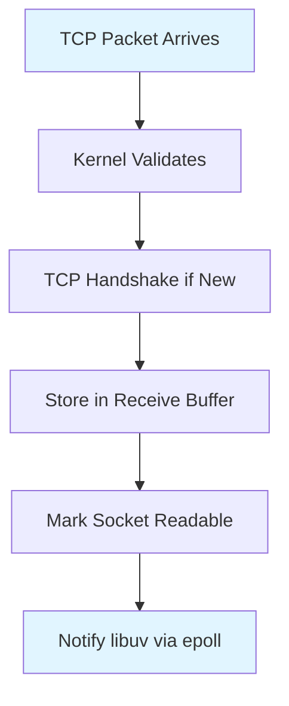
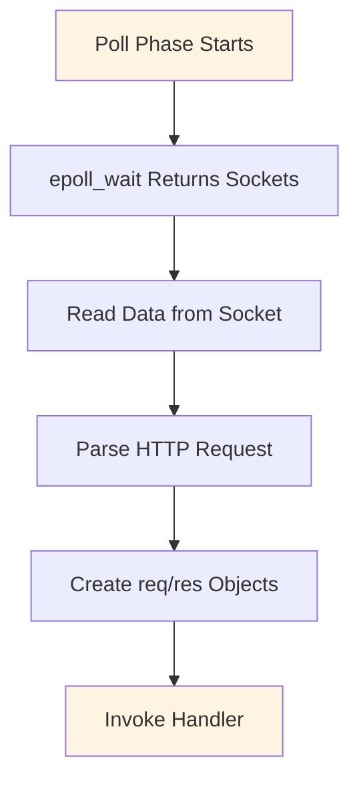
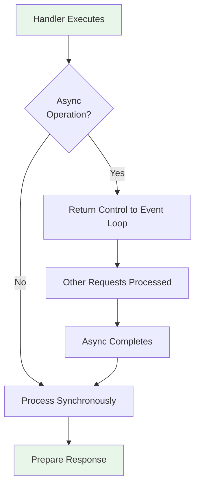
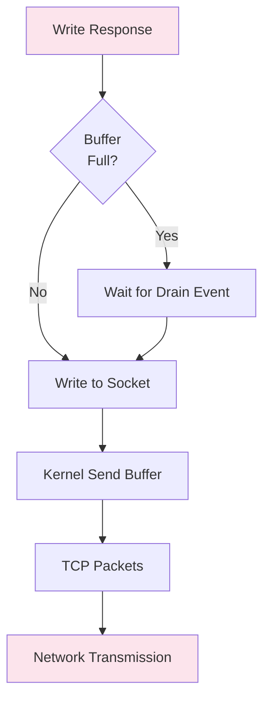
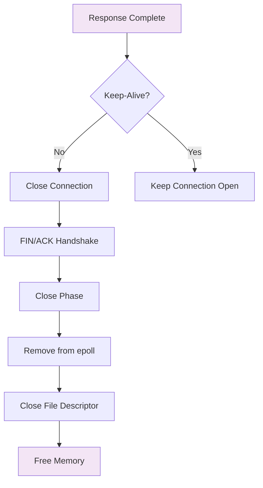

# HTTP Request Lifecycle Flow Diagram

This diagram visualizes the complete HTTP request/response cycle in Node.js from network packet to connection cleanup.

> **Note**: For tools that require pure Mermaid syntax (like Mermaid Live Editor), use the file `http-request-lifecycle.mmd` instead.

## Complete Flow Diagram

```mermaid
flowchart TD
    Start([Client Sends HTTP Request]) --> Phase1[Phase 1: Network & OS Layer]
    
    Phase1 --> Step1[Step 1: Network Packet Arrives<br/>TCP packet travels through network<br/>Arrives at NIC]
    Step1 --> Step2[Step 2: TCP Processing<br/>Kernel validates packet<br/>TCP handshake if new connection]
    Step2 --> Step3[Step 3: Kernel Buffering<br/>Data stored in TCP receive buffer<br/>SO_RCVBUF ~200KB]
    Step3 --> Step4[Step 4: Event Notification<br/>Kernel marks socket readable<br/>epoll/kqueue/IOCP notification]
    
    Step4 --> Phase2[Phase 2: Event Loop Poll Phase]
    
    Phase2 --> Step5[Step 5: Poll Phase Activation<br/>Event loop enters poll phase<br/>epoll_wait returns ready sockets]
    Step5 --> Step6[Step 6: Socket Read Operation<br/>libuv reads from socket<br/>Non-blocking read from kernel buffer]
    Step6 --> Step7[Step 7: HTTP Parsing Begins<br/>llhttp parser processes request line<br/>Extracts method, URL, version]
    Step7 --> Step8[Step 8: Header Parsing<br/>Parser reads headers line by line<br/>Headers end with empty line]
    Step8 --> Step9[Step 9: Request Object Creation<br/>Create IncomingMessage req<br/>Create ServerResponse res]
    Step9 --> Step10[Step 10: Handler Invocation<br/>Server emits request event<br/>Handler called synchronously]
    
    Step10 --> Phase3[Phase 3: Application Processing]
    
    Phase3 --> Step11[Step 11: Handler Execution<br/>Your code processes request<br/>May perform async operations]
    Step11 --> Step12[Step 12: Response Preparation<br/>Set response headers<br/>Write response body]
    
    Step12 --> Phase4[Phase 4: Response Sending]
    
    Phase4 --> Step13[Step 13: Response Writing<br/>Data added to response buffer<br/>Backpressure handling]
    Step13 --> Step14[Step 14: Socket Write Operation<br/>libuv writes to socket<br/>Non-blocking write to kernel]
    Step14 --> Step15[Step 15: Kernel Network Stack<br/>TCP segments data into packets<br/>Adds TCP headers]
    Step15 --> Step16[Step 16: Network Transmission<br/>Packets travel to client<br/>Client receives and processes]
    
    Step16 --> Phase5[Phase 5: Connection Cleanup]
    
    Phase5 --> Step17[Step 17: Response Completion<br/>res.end called and flushed<br/>Connection may close or keep-alive]
    Step17 --> Decision{Connection<br/>Closing?}
    Decision -->|Yes| Step18[Step 18: Connection Closure<br/>FIN/ACK handshake<br/>Socket enters CLOSED state]
    Decision -->|No Keep-Alive| Step19[Step 19: Close Phase Cleanup<br/>Remove from epoll watch list<br/>Close file descriptor<br/>Free memory]
    Step18 --> Step19
    Step19 --> End([End])
    
    style Phase1 fill:#e1f5ff
    style Phase2 fill:#fff4e1
    style Phase3 fill:#e8f5e9
    style Phase4 fill:#fce4ec
    style Phase5 fill:#f3e5f5
    style Start fill:#c8e6c9
    style End fill:#ffcdd2
```

## Simplified High-Level Flow

```mermaid
flowchart LR
    A[Network Packet] --> B[OS Kernel]
    B --> C[libuv/epoll]
    C --> D[Poll Phase]
    D --> E[HTTP Parser]
    E --> F[Handler]
    F --> G[Response]
    G --> H[libuv Write]
    H --> I[OS Kernel]
    I --> J[Network]
    J --> K[Client]
    K --> L[Cleanup]
    
    style A fill:#c8e6c9
    style D fill:#fff4e1
    style F fill:#e8f5e9
    style L fill:#ffcdd2
```

## Phase-by-Phase Breakdown

### Phase 1: Network & OS Layer

### Phase 2: Poll Phase

### Phase 3: Application Processing

### Phase 4: Response Sending

### Phase 5: Cleanup

## Timeline Visualization

```mermaid
gantt
    title HTTP Request Lifecycle Timeline
    dateFormat X
    axisFormat %Lms
    
    section Network & OS
    Packet Arrives           :0, 1
    TCP Processing           :1, 1
    Kernel Buffering         :2, 1
    Event Notification       :3, 1
    
    section Poll Phase
    Poll Activation          :4, 1
    Socket Read              :5, 1
    HTTP Parsing             :6, 1
    Handler Invocation       :7, 1
    
    section Application
    Handler Execution        :8, 2
    
    section Response
    Response Writing         :10, 1
    Socket Write             :11, 1
    Network Transmission     :12, 1
    
    section Cleanup
    Connection Cleanup       :13, 1
```

## How to Use This Diagram

1. **View in Markdown**: If your markdown viewer supports Mermaid (GitHub, GitLab, VS Code with extensions), the diagrams will render automatically.

2. **Mermaid Live Editor**: Copy the Mermaid code and paste it into [mermaid.live](https://mermaid.live) to view and edit.

3. **Export**: Use Mermaid Live Editor or VS Code Mermaid extension to export as PNG, SVG, or PDF.

4. **VS Code Extension**: Install "Markdown Preview Mermaid Support" extension to view diagrams in VS Code.

5. **Include in Documentation**: You can reference this file or copy specific diagrams into your main documentation.

## Notes

- The complete flow diagram shows all 19 steps in sequence
- The simplified diagram shows high-level flow
- Phase breakdowns show detailed steps within each phase
- Timeline shows approximate timing (milliseconds)
- Colors help distinguish different phases

