# HTTP Request Lifecycle Flow Diagram

This diagram visualizes the complete HTTP request/response cycle in Node.js from network packet to connection cleanup.

> **Note**: For tools that require pure Mermaid syntax (like Mermaid Live Editor):
> - Use `http-request-lifecycle-advanced.mmd` for the advanced flow
> - Use `http-request-lifecycle.mmd` for the basic flow

## Advanced Complete Flow Diagram (with TLS, HTTP/2, Microtasks)

This comprehensive diagram includes HTTPS/TLS handling, HTTP/2 multiplexing, microtasks queue, and detailed backpressure management.

```mermaid
flowchart TD
    Start([🌐 Client Sends HTTP Request]) --> TLScheck{🔐 HTTPS?}

    TLScheck -->|Yes| TLS1[🤝 TLS Handshake<br/>ClientHello ServerHello<br/>ALPN selects HTTP version]
    TLS1 --> TLS2[🔑 TLS Key Exchange<br/>Certificate Verification]
    TLS2 --> TLS3[🛡️ Encrypted TCP Stream<br/>Established]
    TLS3 --> NetEntry
    TLScheck -->|No| NetEntry

    NetEntry[📦 Network Packet Arrives<br/>NIC to Kernel Network Stack] --> TCP
    TCP[🔌 TCP Processing<br/>Connection Established<br/>Socket ESTABLISHED] --> KernBuf
    KernBuf[💾 Kernel Receive Buffer<br/>Stores Incoming Bytes] --> Ready
    Ready[📢 Kernel Marks Socket Readable<br/>epoll kqueue IOCP notified] --> PollPhase

    PollPhase[⚡ Event Loop Poll Phase<br/>Ready Socket Returned] --> LibuvRead
    LibuvRead[📖 libuv Reads from Socket<br/>Non Blocking] --> HTTPParser
    HTTPParser[🔍 llhttp Parsing<br/>Method URL Version Headers] --> ParserDecision{📦 Body Exists?}

    ParserDecision -->|Yes| BodyStream[🔄 Streaming Body Parsing<br/>Chunk by Chunk<br/>Backpressure Aware]
    ParserDecision -->|No| CreateReqRes
    BodyStream --> CreateReqRes

    CreateReqRes[🎯 Create IncomingMessage req<br/>and ServerResponse res] --> EmitRequest
    EmitRequest[🚀 Emit request Event<br/>and Call Handler] --> Handler

    Handler[💻 User Handler Executes] --> Microtasks
    Microtasks[🧠 Microtasks Run<br/>nextTick Promises queueMicrotask] --> AsyncOps

    AsyncOps{🔥 Async Operations?} -->|Yes| ReturnToLoop[⏳ Event Loop Waits<br/>for DB IO Timers Workers]
    AsyncOps -->|No| PrepareResponse

    ReturnToLoop --> Microtasks
    ReturnToLoop --> PrepareResponse

    PrepareResponse[📝 Prepare Response<br/>Set Headers Write End] --> BackpressureCheck

    BackpressureCheck{♻️ Write Buffer Full?} -->|Yes| PauseReads[⏸️ Pause Socket Reads<br/>Apply Backpressure]
    PauseReads --> DrainEvent[🔈 drain Event<br/>Resume Writes] --> BackpressureCheck
    BackpressureCheck -->|No| WriteSocket

    WriteSocket[📡 libuv Write to Socket<br/>Non Blocking] --> TLSApply{🔐 TLS Encryption?}

    TLSApply -->|Yes| TLSEncode[🔒 TLS Record Encoding] --> KernelSend
    TLSApply -->|No| KernelSend

    KernelSend[⚙️ Kernel TCP Stack<br/>Segmentation and Checksums] --> NetOut
    NetOut[🌍 Packets Sent to Client] --> Completion

    Completion[🏁 res.end Completed<br/>and Flushed] --> ConnDecision{🔀 Keep Alive?}

    ConnDecision -->|No| CloseTCP
    ConnDecision -->|Yes HTTP/1.1| IdleReuse[♻️ Keep Alive<br/>Idle Wait for Next Request]
    ConnDecision -->|Yes HTTP/2| H2Stream[📶 HTTP/2 Multiplexing<br/>Multiple Streams]

    CloseTCP[🔒 FIN ACK TCP Close<br/>Socket CLOSED] --> CloseCallbacks
    IdleReuse --> Ready
    H2Stream --> Ready

    CloseCallbacks[🗑️ Close Callbacks Phase<br/>Cleanup FD Free Buffers] --> End
    End([✨ End of Lifecycle])

    style Start fill:#C8E6C9,stroke:#2E7D32,stroke-width:3px
    style End fill:#FFCDD2,stroke:#C62828,stroke-width:3px
    style TLScheck fill:#FFF9C4,stroke:#F57F17,stroke-width:2px
    style TLS1 fill:#E1F5FE,stroke:#0288D1,stroke-width:2px
    style TLS2 fill:#E1F5FE,stroke:#0288D1,stroke-width:2px
    style TLS3 fill:#E1F5FE,stroke:#0288D1,stroke-width:2px
    style NetEntry fill:#E1F5FF,stroke:#0288D1,stroke-width:2px
    style TCP fill:#E1F5FF,stroke:#0288D1,stroke-width:2px
    style KernBuf fill:#E1F5FF,stroke:#0288D1,stroke-width:2px
    style Ready fill:#E1F5FF,stroke:#0288D1,stroke-width:2px
    style PollPhase fill:#FFF4E1,stroke:#F57C00,stroke-width:3px
    style LibuvRead fill:#FFF4E1,stroke:#F57C00,stroke-width:2px
    style HTTPParser fill:#FFF4E1,stroke:#F57C00,stroke-width:2px
    style ParserDecision fill:#FFF9C4,stroke:#F57F17,stroke-width:2px
    style BodyStream fill:#FFF4E1,stroke:#F57C00,stroke-width:2px
    style CreateReqRes fill:#FFF4E1,stroke:#F57C00,stroke-width:2px
    style EmitRequest fill:#FFF4E1,stroke:#F57C00,stroke-width:2px
    style Handler fill:#E8F5E9,stroke:#388E3C,stroke-width:3px
    style Microtasks fill:#E1BEE7,stroke:#8E24AA,stroke-width:2px
    style AsyncOps fill:#FFF9C4,stroke:#F57F17,stroke-width:2px
    style ReturnToLoop fill:#E1F5FE,stroke:#0288D1,stroke-width:2px
    style PrepareResponse fill:#E8F5E9,stroke:#388E3C,stroke-width:2px
    style BackpressureCheck fill:#FFF9C4,stroke:#F57F17,stroke-width:2px
    style PauseReads fill:#FFCCBC,stroke:#E64A19,stroke-width:2px
    style DrainEvent fill:#C8E6C9,stroke:#2E7D32,stroke-width:2px
    style WriteSocket fill:#FCE4EC,stroke:#C2185B,stroke-width:2px
    style TLSApply fill:#FFF9C4,stroke:#F57F17,stroke-width:2px
    style TLSEncode fill:#E1F5FE,stroke:#0288D1,stroke-width:2px
    style KernelSend fill:#FCE4EC,stroke:#C2185B,stroke-width:2px
    style NetOut fill:#FCE4EC,stroke:#C2185B,stroke-width:2px
    style Completion fill:#F3E5F5,stroke:#7B1FA2,stroke-width:2px
    style ConnDecision fill:#FFF9C4,stroke:#F57F17,stroke-width:2px
    style CloseTCP fill:#FFCDD2,stroke:#C62828,stroke-width:2px
    style IdleReuse fill:#C8E6C9,stroke:#2E7D32,stroke-width:2px
    style H2Stream fill:#B2DFDB,stroke:#00897B,stroke-width:2px
    style CloseCallbacks fill:#F3E5F5,stroke:#7B1FA2,stroke-width:2px
```

### Advanced Features Covered:

- **🔐 TLS/HTTPS**: Complete TLS handshake including ALPN negotiation
- **🧠 Microtasks Queue**: nextTick, Promises, queueMicrotask execution
- **🔄 Streaming & Backpressure**: Detailed body streaming with backpressure management
- **📶 HTTP/2**: Multiplexing support with stream reuse
- **♻️ Connection Reuse**: HTTP/1.1 keep-alive and HTTP/2 stream handling
- **⏳ Event Loop Interaction**: Shows how async operations return control to event loop

---

## Basic Complete Flow Diagram

```mermaid
flowchart TD
    Start([🌐 Client Sends HTTP Request]) --> Phase1[📦 PHASE 1: Network & OS Layer]
    
    Phase1 --> Step1["🔌 Step 1: Network Packet Arrives<br/>• TCP packet travels through network<br/>• Arrives at server NIC"]
    Step1 --> Step2["🔐 Step 2: TCP Processing<br/>• Kernel validates packet<br/>• TCP handshake if new connection<br/>• Socket → ESTABLISHED state"]
    Step2 --> Step3["💾 Step 3: Kernel Buffering<br/>• Data → TCP receive buffer<br/>• SO_RCVBUF ~200KB"]
    Step3 --> Step4["📢 Step 4: Event Notification<br/>• Kernel marks socket readable<br/>• epoll/kqueue/IOCP notified"]
    
    Step4 --> Phase2[⚡ PHASE 2: Event Loop Poll Phase]
    
    Phase2 --> Step5["🔄 Step 5: Poll Phase Activation<br/>• Event loop enters poll phase<br/>• epoll_wait returns ready sockets"]
    Step5 --> Step6["📖 Step 6: Socket Read Operation<br/>• libuv reads from socket<br/>• Non-blocking read from kernel"]
    Step6 --> Step7["🔍 Step 7: HTTP Parsing Begins<br/>• llhttp parser processes request<br/>• Extracts: method, URL, version"]
    Step7 --> Step8["📋 Step 8: Header Parsing<br/>• Parser reads headers line by line<br/>• Headers end with \\r\\n\\r\\n"]
    Step8 --> Step9["🎯 Step 9: Request Object Creation<br/>• Create IncomingMessage req<br/>• Create ServerResponse res"]
    Step9 --> Step10["🚀 Step 10: Handler Invocation<br/>• Server emits 'request' event<br/>• Handler called synchronously"]
    
    Step10 --> Phase3[💻 PHASE 3: Application Processing]
    
    Phase3 --> Step11["⚙️ Step 11: Handler Execution<br/>• Your code processes request<br/>• May perform async operations"]
    Step11 --> Step12["📝 Step 12: Response Preparation<br/>• Set response headers<br/>• Write response body"]
    
    Step12 --> Phase4[📤 PHASE 4: Response Sending]
    
    Phase4 --> Step13["✍️ Step 13: Response Writing<br/>• Data → response buffer<br/>• Backpressure handling"]
    Step13 --> Step14["📡 Step 14: Socket Write Operation<br/>• libuv writes to socket<br/>• Non-blocking write to kernel"]
    Step14 --> Step15["🔧 Step 15: Kernel Network Stack<br/>• TCP segments data into packets<br/>• Adds TCP headers, checksums"]
    Step15 --> Step16["🌍 Step 16: Network Transmission<br/>• Packets travel to client<br/>• Client receives and processes"]
    
    Step16 --> Phase5[🧹 PHASE 5: Connection Cleanup]
    
    Phase5 --> Step17["✅ Step 17: Response Completion<br/>• res.end called and flushed<br/>• Connection decision point"]
    Step17 --> Decision{🔀 Connection<br/>Closing?}
    Decision -->|Yes| Step18["🔒 Step 18: Connection Closure<br/>• FIN/ACK handshake<br/>• Socket → CLOSED state"]
    Decision -->|No, Keep-Alive| KeepAlive["♻️ Connection Kept Open<br/>• Reuse for next request<br/>• Timeout after idle period"]
    Step18 --> Step19["🗑️ Step 19: Close Phase Cleanup<br/>• Remove from epoll watch list<br/>• Close file descriptor<br/>• Free memory buffers"]
    KeepAlive -.->|Eventually| Step19
    Step19 --> End([✨ End])
    
    style Phase1 fill:#e1f5ff,stroke:#0288d1,stroke-width:3px
    style Phase2 fill:#fff4e1,stroke:#f57c00,stroke-width:3px
    style Phase3 fill:#e8f5e9,stroke:#388e3c,stroke-width:3px
    style Phase4 fill:#fce4ec,stroke:#c2185b,stroke-width:3px
    style Phase5 fill:#f3e5f5,stroke:#7b1fa2,stroke-width:3px
    style Start fill:#c8e6c9,stroke:#2e7d32,stroke-width:2px
    style End fill:#ffcdd2,stroke:#c62828,stroke-width:2px
    style Decision fill:#fff9c4,stroke:#f57f17,stroke-width:2px
    style KeepAlive fill:#e1bee7,stroke:#8e24aa,stroke-width:2px
```

## Simplified High-Level Flow

```mermaid
flowchart LR
    A["🔌 Network<br/>Packet"] --> B["🖥️ OS<br/>Kernel"]
    B --> C["⚙️ libuv/<br/>epoll"]
    C --> D["⚡ Poll<br/>Phase"]
    D --> E["🔍 HTTP<br/>Parser"]
    E --> F["💻 Your<br/>Handler"]
    F --> G["📝 Response<br/>Generation"]
    G --> H["📡 libuv<br/>Write"]
    H --> I["🖥️ OS<br/>Kernel"]
    I --> J["🌍 Network<br/>Stack"]
    J --> K["🌐 Client<br/>Receives"]
    K --> L["🧹 Cleanup"]
    
    style A fill:#c8e6c9,stroke:#2e7d32,stroke-width:2px
    style D fill:#fff4e1,stroke:#f57c00,stroke-width:2px
    style F fill:#e8f5e9,stroke:#388e3c,stroke-width:2px
    style L fill:#ffcdd2,stroke:#c62828,stroke-width:2px
    style B fill:#e3f2fd,stroke:#1976d2,stroke-width:2px
    style C fill:#e3f2fd,stroke:#1976d2,stroke-width:2px
    style E fill:#fff9c4,stroke:#f57f17,stroke-width:2px
    style G fill:#fce4ec,stroke:#c2185b,stroke-width:2px
    style H fill:#fce4ec,stroke:#c2185b,stroke-width:2px
    style I fill:#e3f2fd,stroke:#1976d2,stroke-width:2px
    style J fill:#e1f5fe,stroke:#0288d1,stroke-width:2px
    style K fill:#c5cae9,stroke:#3f51b5,stroke-width:2px
```

## Phase-by-Phase Breakdown

### Phase 1: Network & OS Layer

```mermaid
flowchart TD
    A["🔌 TCP Packet Arrives<br/>From Network"] --> B["🔐 Kernel Validates<br/>Checksum, Sequence"]
    B --> C["🤝 TCP Handshake<br/>if New Connection"]
    C --> D["💾 Store in Receive Buffer<br/>SO_RCVBUF"]
    D --> E["✅ Mark Socket Readable<br/>Update Internal State"]
    E --> F["📢 Notify libuv<br/>via epoll/kqueue"]
    
    style A fill:#e1f5ff,stroke:#0288d1,stroke-width:2px
    style B fill:#e1f5ff,stroke:#0288d1,stroke-width:2px
    style C fill:#e1f5ff,stroke:#0288d1,stroke-width:2px
    style D fill:#e1f5ff,stroke:#0288d1,stroke-width:2px
    style E fill:#e1f5ff,stroke:#0288d1,stroke-width:2px
    style F fill:#e1f5ff,stroke:#0288d1,stroke-width:3px
```

### Phase 2: Poll Phase

```mermaid
flowchart TD
    A["⚡ Poll Phase Starts<br/>Event Loop Entry"] --> B["🔍 epoll_wait Returns<br/>Ready Sockets"]
    B --> C["📖 Read Data from Socket<br/>Non-blocking I/O"]
    C --> D["🔎 Parse HTTP Request<br/>llhttp Parser"]
    D --> E["🎯 Create req/res Objects<br/>IncomingMessage + ServerResponse"]
    E --> F["🚀 Invoke Your Handler<br/>Synchronously"]
    
    style A fill:#fff4e1,stroke:#f57c00,stroke-width:3px
    style B fill:#fff4e1,stroke:#f57c00,stroke-width:2px
    style C fill:#fff4e1,stroke:#f57c00,stroke-width:2px
    style D fill:#fff4e1,stroke:#f57c00,stroke-width:2px
    style E fill:#fff4e1,stroke:#f57c00,stroke-width:2px
    style F fill:#fff4e1,stroke:#f57c00,stroke-width:3px
```

### Phase 3: Application Processing

```mermaid
flowchart TD
    A["💻 Handler Executes<br/>Your Code Runs"] --> B{"🤔 Async<br/>Operation?"}
    B -->|"Yes (await)"| C["↩️ Return Control<br/>to Event Loop"]
    B -->|"No (sync)"| D["⚙️ Process<br/>Synchronously"]
    C --> E["🔄 Other Requests<br/>Processed Meanwhile"]
    E --> F["✅ Async Operation<br/>Completes"]
    F --> D
    D --> G["📝 Prepare Response<br/>Headers + Body"]
    
    style A fill:#e8f5e9,stroke:#388e3c,stroke-width:3px
    style B fill:#fff9c4,stroke:#f57f17,stroke-width:2px
    style C fill:#e1f5fe,stroke:#0288d1,stroke-width:2px
    style D fill:#e8f5e9,stroke:#388e3c,stroke-width:2px
    style E fill:#e1f5fe,stroke:#0288d1,stroke-width:2px
    style F fill:#c8e6c9,stroke:#2e7d32,stroke-width:2px
    style G fill:#e8f5e9,stroke:#388e3c,stroke-width:3px
```

### Phase 4: Response Sending

```mermaid
flowchart TD
    A["✍️ Write Response<br/>res.write/res.end"] --> B{"⚠️ Buffer<br/>Full?"}
    B -->|"Yes"| C["⏳ Wait for Drain Event<br/>Backpressure"]
    B -->|"No"| D["📡 Write to Socket<br/>Non-blocking"]
    C --> D
    D --> E["💾 Kernel Send Buffer<br/>SO_SNDBUF"]
    E --> F["📦 TCP Packets<br/>Segmentation"]
    F --> G["🌍 Network Transmission<br/>To Client"]
    
    style A fill:#fce4ec,stroke:#c2185b,stroke-width:3px
    style B fill:#fff9c4,stroke:#f57f17,stroke-width:2px
    style C fill:#ffccbc,stroke:#e64a19,stroke-width:2px
    style D fill:#fce4ec,stroke:#c2185b,stroke-width:2px
    style E fill:#fce4ec,stroke:#c2185b,stroke-width:2px
    style F fill:#fce4ec,stroke:#c2185b,stroke-width:2px
    style G fill:#fce4ec,stroke:#c2185b,stroke-width:3px
```

### Phase 5: Cleanup

```mermaid
flowchart TD
    A["✅ Response Complete<br/>res.end flushed"] --> B{"♻️ Keep-Alive?"}
    B -->|"No"| C["🔒 Close Connection<br/>Initiate Closure"]
    B -->|"Yes"| D["✨ Keep Connection Open<br/>Reuse for Next Request"]
    C --> E["🤝 FIN/ACK Handshake<br/>TCP Termination"]
    D -.->|"After Timeout"| E
    E --> F["🧹 Close Phase Entry<br/>Event Loop"]
    F --> G["📋 Remove from epoll<br/>Stop Watching"]
    G --> H["🔐 Close File Descriptor<br/>Release FD"]
    H --> I["🗑️ Free Memory<br/>Garbage Collection"]
    
    style A fill:#f3e5f5,stroke:#7b1fa2,stroke-width:3px
    style B fill:#fff9c4,stroke:#f57f17,stroke-width:2px
    style C fill:#ffcdd2,stroke:#c62828,stroke-width:2px
    style D fill:#c8e6c9,stroke:#2e7d32,stroke-width:2px
    style E fill:#f3e5f5,stroke:#7b1fa2,stroke-width:2px
    style F fill:#f3e5f5,stroke:#7b1fa2,stroke-width:2px
    style G fill:#f3e5f5,stroke:#7b1fa2,stroke-width:2px
    style H fill:#f3e5f5,stroke:#7b1fa2,stroke-width:2px
    style I fill:#f3e5f5,stroke:#7b1fa2,stroke-width:3px
```

## Timeline Visualization

```mermaid
gantt
    title HTTP Request Lifecycle Timeline (Typical Timing)
    dateFormat X
    axisFormat %Lms
    
    section 📦 Network & OS
    Packet Arrives           :done, 0, 1
    TCP Processing           :done, 1, 1
    Kernel Buffering         :done, 2, 1
    Event Notification       :done, 3, 1
    
    section ⚡ Poll Phase
    Poll Activation          :active, 4, 1
    Socket Read              :active, 5, 1
    HTTP Parsing             :active, 6, 1
    Handler Invocation       :active, 7, 1
    
    section 💻 Application
    Handler Execution        :crit, 8, 2
    
    section 📤 Response
    Response Writing         :10, 1
    Socket Write             :11, 1
    Network Transmission     :12, 1
    
    section 🧹 Cleanup
    Connection Cleanup       :13, 1
```

## Async Request Timeline Comparison

## How to Use These Diagrams

### Viewing Options

1. **GitHub/GitLab**: Push this file and view it directly - Mermaid renders automatically
2. **VS Code**: 
   - Install "Markdown Preview Mermaid Support" extension
   - Open this file and use markdown preview (Cmd/Ctrl + Shift + V)
3. **Mermaid Live Editor**: 
   - Go to [mermaid.live](https://mermaid.live)
   - Copy any diagram code and paste it there
   - Use the pure `.mmd` file for easier copying
4. **Export Options**:
   - Mermaid Live Editor: Export as PNG, SVG, or PDF
   - VS Code Mermaid extension: Right-click → Export
   - GitHub: Take screenshots of rendered diagrams

### Diagram Types Included

| Diagram | Purpose | Best For |
|---------|---------|----------|
| **Advanced Flow** | TLS, HTTP/2, Microtasks, Backpressure | Production-grade understanding |
| Complete Flow | All 19 steps in detail | Deep understanding |
| Simplified Flow | High-level overview | Quick reference |
| Phase Breakdowns | Focus on each phase | Learning specific phases |
| Timeline | Timing visualization | Understanding performance |
| Async Comparison | Sync vs Async | Understanding concurrency |

### Color Legend

| Color | Phase | Description |
|-------|-------|-------------|
| 🔵 Blue | Network & OS Layer | Kernel, TCP, buffers |
| 🟠 Orange | Poll Phase | Event loop, HTTP parsing |
| 🟢 Green | Application | Your handler code |
| 🔴 Pink/Red | Response Sending | Writing, network transmission |
| 🟣 Purple | Cleanup | Connection closure, memory |
| 🟡 Yellow | Decision Points | Conditional logic |

### Tips

- **For Learning**: Start with simplified flow, then dive into phase breakdowns
- **For Debugging**: Use complete flow to trace where issues occur
- **For Performance**: Study timeline to identify bottlenecks
- **For Presentations**: Export simplified flow as PNG/SVG

## Notes

- **Advanced flow** includes TLS/HTTPS, HTTP/2 multiplexing, microtasks queue, and backpressure handling
- **Complete flow** shows all 19 steps with emojis for quick identification
- **Simplified flow** shows high-level components
- **Phase breakdowns** show detailed steps within each phase
- **Timeline** shows approximate timing in milliseconds
- **Async comparison** demonstrates why Node.js handles concurrent requests efficiently
- All diagrams use consistent color coding for easy navigation

## Key Differences: Advanced vs Basic Flow

| Feature | Advanced Flow | Basic Flow |
|---------|---------------|------------|
| TLS/HTTPS | ✅ Full TLS handshake & encryption | ❌ HTTP only |
| HTTP/2 | ✅ Multiplexing & streams | ❌ HTTP/1.1 only |
| Microtasks | ✅ nextTick, Promises queue | ❌ Not shown |
| Backpressure | ✅ Detailed pause/resume | ✅ Basic mention |
| Body Streaming | ✅ Chunk-by-chunk parsing | ✅ Basic mention |
| Complexity | Production-ready | Learning-focused |

### When to Use Which Diagram?

- **Learning Node.js**: Start with Basic Complete Flow → Phase Breakdowns
- **Understanding HTTPS**: Use Advanced Flow (shows TLS handshake)
- **Debugging Performance**: Use Timeline + Advanced Flow
- **Learning HTTP/2**: Use Advanced Flow (shows multiplexing)
- **Quick Reference**: Use Simplified Flow
- **Teaching/Presentations**: Use Simplified or Basic Flow

